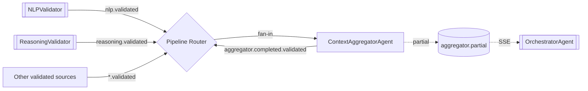

# ContextAggregatorAgent

> **Status:** Active
> **Flavor:** agent (self-validating — no separate validator sidecar)
> **Container:** `context_aggregator`
> **Port:** 8011
> **Tech:** FastAPI + `BaseKafkaAgent` + LLM synthesis + per-job quorum tracker

---

## Role

Synthesise multiple upstream outputs (NLP, Reasoning, history, sentiment, ...) into a single coherent clinical artefact. Detects conflicts (e.g. NLP says "stable" but Reasoning says "deteriorating"), weighs sources by confidence, and either reconciles via LLM arbitration or reports the conflict. Self-validates → publishes directly to `{output_topic}.validated`.

Per AG-1 / AG-3 phases.

---

## Position in Pipeline



Quorum-based — waits for `min_required_inputs` upstream outputs before synthesising; 5s timeout watchdog forces synthesis even if some inputs are slow.

---

## Contracts

### Kafka

| Direction | Topic | Group |
|---|---|---|
| In | `{input_topic}` per `aggregator_definition` (multiple sources) | `context-aggregator` |
| Partial out | `aggregator.partial` | — (each input arrival — for SSE) |
| Final out | `{output_topic}.validated` | — (self-validated) |

Multi-instance: container loads ONE `aggregator_definition` named by `AGGREGATOR_NAME` env var.

Output payload:
```json
{"job_id": "...", "data": {
  "synthesis": {...},
  "confidence": 0.87,
  "_conflicts": ["dx_field"],
  "_aggregator": {
    "job_id": "...", "inputs_used": [...], "llm": "...",
    "conflicts_detected": true, "conflict_fields": [...]
  }
}}
```

### Synthesis logic (`app/services/aggregator_service.py`)

1. Wait for ≥ `min_required_inputs` arrivals (Redis-backed quorum or in-memory per-job map)
2. Python-side conflict detection on `_CONFLICT_FIELDS` list (no LLM cost)
3. Effective weight per source: `base_weight * agent_confidence`
4. If conflicts present → LLM arbitration via `chat_completion()` with `synthesis_prompt`
5. If no conflicts → weighted merge, single LLM polish call
6. Apply `output_persona` hint (clinician / patient / ehr_import) + `output_schema_type` (soap / structured_json / fhir)

### Partial SSE (AG-3)

Every input arrival publishes to `aggregator.partial` with a snapshot — [[OrchestratorAgent]] relays as SSE so frontend can show progressive aggregation.

---

## Dependencies

- **HTTP:** [[ConfigService]] for `aggregator_definitions.{AGGREGATOR_NAME}`
- **Redis:** per-job quorum buffer (optional impl; current uses in-memory)
- **External:** LLM via `chat_completion()` ([[shared]]) — provider from `llm_instance_name`
- **Internal:** [[shared]], [[ConfigService]]
- **DB:** `token_usage_log`

---

## Side Effects

- LLM calls (1–N depending on conflicts)
- `aggregator.partial` per input arrival
- `{output_topic}.validated` once on synthesis

---

## Failure Modes

| Symptom | Cause | Fix |
|---|---|---|
| Not synthesising | `AGGREGATOR_NAME` env unset or definition missing | Check compose env + `aggregator_definitions` row |
| Stuck waiting | Upstream source missing; quorum not reached | 5s timeout fires; synthesises on what's available |
| Conflict detection misses | Field not in `_CONFLICT_FIELDS` | Add to const list in `aggregator_service.py` |
| Wrong persona output | `output_persona` field mismatched | Update `aggregator_definitions` row via API |
| Validates as garbage | Self-validation bypassed; relies on synthesis quality | Tighten `synthesis_prompt` |

---

## PHI Surface

- **Input:** every upstream validated output (PHI-dense)
- **Output:** synthesised result — most concentrated PHI in pipeline
- **External egress:** all inputs sent to LLM provider
- **DB:** `token_usage_log` only (no text)

---

## Config

| Var | Purpose |
|---|---|
| `AGGREGATOR_NAME` | Selects which `aggregator_definition` to load (one per container) |
| `CONFIG_SERVICE_URL` | Definition fetch |
| `REDIS_URL`, `KAFKA_BOOTSTRAP_SERVERS`, `APP_DATABASE_URL` | Standard |
| `AGENT_CONCURRENCY` | Default 5 |

Definition fields (in `aggregator_definitions` table): `input_sources` (JSON array), `min_required_inputs`, `timeout_seconds`, `output_persona`, `output_schema_type`, `synthesis_prompt`, `llm_instance_name`, `max_tokens`, `temperature`.

---

## Observability

- `agent_processed_total{agent_name="context_aggregator"}`
- `llm_call_total{provider, model_name}` (1–N per job)
- `aggregator_conflicts_total` (custom — if added; document if you add)
- Logs include `_aggregator` metadata block

---

## Common Change Recipes

### Add a new conflict field
1. Add to `_CONFLICT_FIELDS` in `aggregator_service.py`
2. No DB change

### Add a new aggregator definition (separate persona / pipeline)
1. UI → Aggregator Definitions → New — name, input_topic, output_topic, input_sources, prompt, persona
2. New container in `docker-compose.yml` with `AGGREGATOR_NAME=<new name>` (or reuse existing if topic differs)

### Switch to FHIR output
- Set `output_schema_type = "fhir"` on the definition; synthesis prompt should produce FHIR Bundle JSON
- Downstream consumers must accept FHIR shape

### Tune quorum
- Change `min_required_inputs` and `timeout_seconds` on the definition

---

## Cross-links

- [[NLPValidator]], [[ReasoningValidator]] — typical upstreams via router
- [[OrchestratorAgent]] — consumes `aggregator.partial` for SSE
- [[ConfigService]] — `aggregator_definitions` source
- [[shared]] — `chat_completion`
- [`CLAUDE.md`](../CLAUDE.md) — AG-1 / AG-3 phase notes
