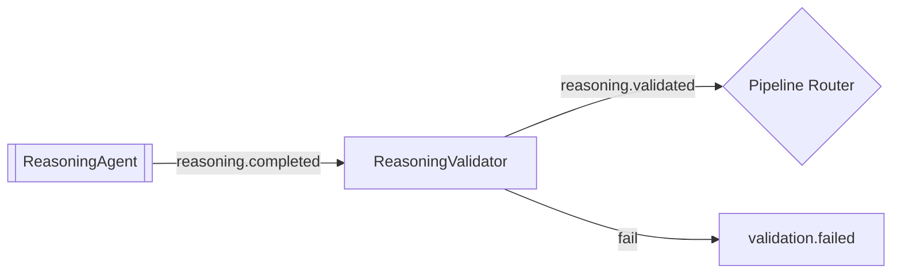

# ReasoningValidator

> **Status:** Active
> **Flavor:** agent
> **Container:** `reasoning_validator`
> **Port:** 8006
> **Tech:** FastAPI + `BaseKafkaAgent`

---

## Role

Gate Reasoning output. Schema check + confidence threshold. Mirrors [[NLPValidator]] but tuned for reasoning's structured payload.

---

## Position in Pipeline

---

## Contracts

### Kafka

| Direction | Topic | Group |
|---|---|---|
| In | `reasoning.completed` | `reasoning-validator` |
| Out pass | `reasoning.validated` | — |
| Out fail | `validation.failed` | — |

### Checks (`app/services/validator.py`)

1. Strip stop tokens / extract JSON (same helpers as [[NLPValidator]])
2. JSON Schema check against action's `output_schema`
3. **`overall_confidence` required field** — must be numeric, 0 ≤ x ≤ 1
4. Optional threshold check from `validation_rules` (`min_confidence`)

---

## Dependencies

- **HTTP:** [[ConfigService]] for `output_schema` + `validation_rules` (step_name `reasoning`)
- **Internal:** [[shared]]

---

## Side Effects

- Pass/fail Kafka produce
- Standard metrics + logs

---

## Failure Modes

| Symptom | Cause | Fix |
|---|---|---|
| `reasoning.completed` rejected | Missing `overall_confidence` | Fix prompt in ConfigService |
| Threshold rejection | Low-confidence LLM response | Lower threshold or improve prompt |
| Parse fail | Token bleed in Claude streaming output | Strip regex in `validator.py` |

---

## PHI Surface

- Reads reasoning output (PHI-dense)
- No durable store
- Same logging caveat as [[NLPValidator]] — don't log raw payload

---

## Config

| Var | Purpose |
|---|---|
| `CONFIG_SERVICE_URL` | Schema + rules |
| Standard agent vars | Kafka, Redis, concurrency |

---

## Observability

- `agent_processed_total{agent_name="reasoning_validator", status}`

---

## Common Change Recipes

### Add a new schema field
- Edit `prompt_templates.output_schema` for that reasoning action; validator picks up next message

### Adjust confidence threshold
- UI → Validation Rules → `step_name=reasoning` → edit `min_confidence`

---

## Cross-links

- [[ReasoningAgent]] — produces input
- [[OrchestratorAgent]] — handles `validation.failed`
- [[ConfigService]] — rule + schema source
- [[NLPValidator]] — sibling; shares strip helpers
