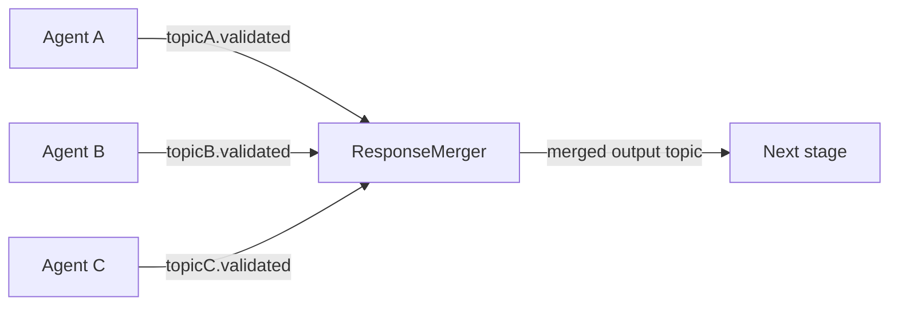

# ResponseMerger

> **Status:** Active
> **Flavor:** agent (fan-in)
> **Container:** `response_merger`
> **Port:** 8022
> **Tech:** FastAPI + `BaseKafkaAgent` (dynamic multi-topic) + Redis quorum buffer

---

## Role

Wait for N parallel agent outputs that share a `job_id`, merge them into a single JSON, and publish to a downstream topic. Used after `edge_type="parallel_fanout"` in the pipeline graph.

---

## Position in Pipeline



---

## Contracts

### Kafka

| Direction | Topic | Group |
|---|---|---|
| In | all topics in `response_mergers.input_topic_map.keys()` | per-merger group |
| Out | `response_mergers.output_topic` | — |

### Definition fields (`response_mergers` table)

- `name` — merger identity
- `input_topic_map` — JSON `{"topic.name": "output_field_name", ...}` — topic → key in the merged JSON
- `output_topic` — destination
- `timeout_seconds` — Redis key expiry; partial merge if not reached

### Merge algorithm (`app/services/kafka_service.py`)

1. On message arrival: `HSET merger:{name}:{job_id} <field> <json_dumps(value)>`
2. `EXPIRE` set to `timeout_seconds` (sliding via re-set on each write)
3. If `HLEN >= expected_count` → read all fields, `DEL` the key, publish merged JSON
4. If timeout fires first → caller dependent (most mergers expect all inputs; partial behaviour not auto)

Output payload:
```json
{"job_id": "...", "step_name": "<merger-name>",
 "data": {"merged_output": {"<field>": <value>, ...}}}
```

---

## Dependencies

- **HTTP:** [[ConfigService]] for `response_mergers` (loaded on boot)
- **Redis:** quorum buffer keys `merger:{name}:{job_id}`
- **Internal:** [[shared]] (`BaseKafkaAgent`)

No DB, no LLM.

---

## Side Effects

- Redis HSET / EXPIRE / DEL per merger key
- Single Kafka produce per completed merge

---

## Failure Modes

| Symptom | Cause | Fix |
|---|---|---|
| Not merging | Redis key expired before all inputs arrived | Increase `timeout_seconds` |
| Stuck forever | One input topic never produces | Check upstream agents; merger never fires until count or timeout |
| Wrong output shape | `input_topic_map` field name mismatch | Edit definition via UI |
| Duplicate field collision | Two topics map to same field name | Define unique field names per topic |

---

## PHI Surface

- Reads all upstream `*.validated` payloads (PHI)
- Redis stores them temporarily (TTL bound to `timeout_seconds`)
- No durable store

---

## Config

| Var | Purpose |
|---|---|
| `CONFIG_SERVICE_URL` | Definition fetch on boot |
| `REDIS_URL` | Quorum buffer |
| Standard agent vars | Kafka, concurrency |

---

## Observability

- `agent_processed_total{agent_name="response_merger", status="merged|timeout"}`

---

## Common Change Recipes

### Add a new merger
1. UI → Response Mergers → New — name, input_topic_map, output_topic, timeout_seconds
2. Pipeline builder — connect parallel agents with `edge_type=parallel_fanout`, terminating in a merger node (`agent_type: 'output_merger'`)
3. Restart `response_merger` to refetch definitions

### Adjust timeout
- Edit `timeout_seconds` on the definition; effective next boot

### Handle partial merges
- Current behaviour: timeout drops the buffer. To allow partial outputs, custom logic needed in `kafka_service.py` (currently not implemented).

---

## Cross-links

- [[ConfigService]] — `response_mergers` storage
- Upstream agents — any `*.validated` topic can feed a merger
- [[shared]] — `BaseKafkaAgent`
- [`CLAUDE.md`](../CLAUDE.md) — quorum pattern, `edge_type` semantics
