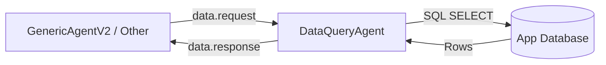

# DataQueryAgent

> **Status:** Active
> **Flavor:** internal-service
> **Container:** `data_query_agent`
> **Tech:** FastAPI + `BaseKafkaAgent` + SQLAlchemy

---

## Role

The **DataQueryAgent** provides a specialized "Fact-as-a-Service" interface for other agents. It executes named, read-only SQL queries against the application database and returns structured results via Kafka.

It is designed to be the ground-truth provider for [[GenericAgentV2]], allowing LLMs to access live database state (e.g., patient records, audit logs, configuration) without having direct DB access or SQL generation responsibilities.

---

## Position in Pipeline



---

## Contracts

### Kafka (RPC-style)

**Request Topic (`data.request`):**
```json
{
    "request_id": "uuid",
    "job_id": "uuid",
    "reply_topic": "string (optional, defaults to data.response)",
    "query_name": "string (name of pre-defined query)",
    "params": {"key": "value"}
}
```

**Response Topic (variable, defaults to `data.response`):**
```json
{
    "request_id": "uuid",
    "job_id": "uuid",
    "query_name": "string",
    "status": "ok | error",
    "rows": [{}],
    "error": "string | null"
}
```

---

## Named Queries

All available queries are pre-defined in `app/services/queries.py`. This ensures:
1. **Security:** No arbitrary SQL injection; only sanctioned SELECTs.
2. **Performance:** Queries are optimized and indexed.
3. **Consistency:** Agents use stable named interfaces rather than raw schema knowledge.

---

## Dependencies

- **DB:** Application Database (PostgreSQL) — Read Only.
- **Internal:** [[shared]] (`BaseKafkaAgent`).

---

## Side Effects

- Database read load.
- No write operations (idempotent reprocessing).

---

## Failure Modes

| Symptom | Cause | Fix |
|---|---|---|
| `status: "error"` | Unknown `query_name` | Verify name in `NAMED_QUERIES` map |
| Timeout in caller | DB lock or complex query | Optimize SQL or increase `DATA_QUERY_TIMEOUT` in caller |
| Empty rows | Filter criteria (params) too restrictive | Check param values in caller logs |

---

## Config

| Var | Purpose |
|---|---|
| `QUERY_DB_URL` | DB connection string |
| `KAFKA_BOOTSTRAP_SERVERS` | Standard |

---

## Cross-links

- [[GenericAgentV2]] — Primary consumer
- [[shared]] — `BaseKafkaAgent` foundation
