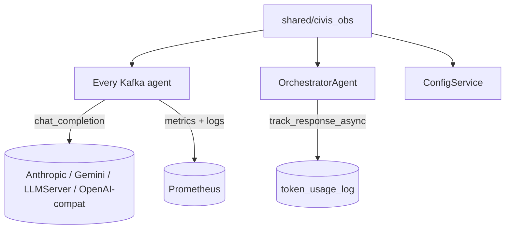

# shared / civis_obs

> **Status:** Active
> **Flavor:** lib
> **Package:** `civis-obs` (importable as `civis_obs`)
> **Layout:** `shared/civis_obs/`
> **Consumers:** every civis service except `LLMServer` and `frontend` / `android`

---

## Role

Single shared Python lib for every civis service. Three responsibilities:

1. **Kafka consumer base class** — `BaseKafkaAgent` ABC; every agent extends it.
2. **LLM dispatch** — `chat_completion()` is the only sanctioned LLM call path.
3. **Observability primitives** — Prometheus metrics, JSON logging, health endpoints, token usage tracking.

No business logic lives here. Anything specific to one agent stays in that agent's repo.

---

## Position in Pipeline



Lib is a leaf in the dependency graph — depends on nothing internal, everything depends on it.

---

## Contracts

### Public API surface

| Symbol | Module | Purpose |
|---|---|---|
| `configure_logging(service_name)` | `logging_config` | JSON logger; redacts `mk_` keys; binds `job_id` via contextvars |
| `set_job_context(job_id)` / `clear_job_context()` | `logging_config` | Per-task contextvars for log enrichment |
| `metrics` (counter / histogram registry) | `metrics` | 6 standard metrics shared across services |
| `mount_metrics_endpoint(app)` | `metrics` | Adds `/metrics` to a FastAPI app |
| `make_health_router(checks)` | `health` | Returns `/health/live` + `/health/ready` router |
| `check_postgres(url)`, `check_redis(url)`, `check_kafka(servers)`, `check_http(url)` | `health` | Common readiness probes |
| `BaseKafkaAgent` | `kafka_consumer` | ABC for Kafka-driven agents; consumer loop, semaphore, runtime config watch |
| `get_consumer(topic, group)` / `get_producer()` | `kafka_utils` | Canonical AIOKafka factories |
| `chat_completion(...)` → `LLMResult` | `llm_client` | Unified LLM dispatch (Anthropic / Gemini / llama-cpp / OpenAI-compat) |
| `set_token_context(pipeline_id, agent_name, request_id)` / `clear_token_context()` | `token_tracker` | Per-task contextvars for usage attribution |
| `track_async(...)`, `track_response_async(service_name, result)` | `token_tracker` | Persist `token_usage_log` row (fire-and-forget) |
| `TokenTracker`, `TokenCounter`, `ResponseParser` | `token_tracker` | Lower-level helpers for non-`chat_completion` paths |

`__init__.py` re-exports the high-level names.

### `BaseKafkaAgent` contract (most important)

Subclasses override:
- `INPUT_TOPIC: str` — class var
- `OUTPUT_TOPIC: str` — class var (skip if dynamic, e.g. `GenericAgent`)
- `GROUP_ID: str` — class var
- `MAX_CONCURRENT: int = 5` — default; override via `AGENT_CONCURRENCY` env or runtime Redis push
- `async def process(self, message: dict) -> dict | None` — business logic

Provided by base:
- Consumer loop with 10s reconnect backoff
- `_ResizableSemaphore` — backpressure (acquire before `create_task`)
- `_watch_config()` — listens to Redis pub/sub `agent.config.{name}` for live concurrency updates (AS-3)
- `_process_guarded()` — wraps `process()`, sets token + log context, emits metrics, dead-letters on uncaught exception
- DLQ publish on uncaught — message lands in `agent.deadletter` with `error`, `step_name`, `original_message`
- Validator routing — if `OUTPUT_TOPIC` ends in `.completed`, message is implicitly destined for the matching validator (no extra wiring needed)

### `chat_completion()` contract (`llm_client.py`)

Signature (paraphrased):
```python
async def chat_completion(
    llm_instance_name: str,        # row in llm_instances
    messages: list[dict],           # [{"role": ..., "content": ...}]
    *,
    response_format: dict | None = None,   # JSON-mode for providers that support it
    max_tokens: int | None = None,
    temperature: float | None = None,
    tools: list[dict] | None = None,       # native tool-calling (Anthropic, OpenAI-compat)
    stream_callback: Callable | None = None,  # token-by-token (Anthropic streaming)
) -> LLMResult
```

`LLMResult` fields: `text`, `input_tokens`, `output_tokens`, `model_name`, `provider`, `tool_calls`.

Providers:
- `anthropic` — official SDK, streaming, native tool-calling
- `gemini` — `google.genai` sync client wrapped in threadpool (lazy import)
- `llamacpp` / `openai_compat` — HTTP via `httpx` to OpenAI-compat endpoints (works for [[LLMServer]] and any vLLM-style server)

Lazy imports: provider modules are imported **inside** each function. Tests must mock via `sys.modules["anthropic"] = mock` before calling — `from civis_obs.llm_client import anthropic` won't expose anything to patch.

---

## Dependencies

- **Postgres:** `token_usage_log` via `token_tracker.DatabaseHandler` (lazy `APP_DATABASE_URL` lookup; thread pool writes; failures swallowed)
- **Redis:** pub/sub `agent.config.{name}` and key `agent:{name}:concurrency` (AS-2 / AS-3)
- **Kafka:** AIOKafka via `aiokafka`
- **External SDKs (lazy):** `anthropic`, `google.genai`, `httpx`
- **Internal:** none — leaf lib

---

## Side Effects

- Writes `token_usage_log` rows (best-effort; `civis_TOKEN_TRACK_DB=0` disables)
- Publishes to `agent.deadletter` on uncaught agent exception
- Emits Prometheus metrics
- Emits structured JSON logs to stdout

---

## Failure Modes

| Symptom | Cause | Fix |
|---|---|---|
| `AttributeError: module 'anthropic' has no attribute 'Anthropic'` in tests | Mock applied after lazy import resolved | Mock via `sys.modules["anthropic"] = mock` **before** importing `chat_completion` |
| Token usage rows missing | `APP_DATABASE_URL` not set in that service | Set env or accept logging-only |
| `agent:{name}:concurrency` not honoured | Redis unreachable at startup | Falls back to `AGENT_CONCURRENCY` env or default 5 (fail-open) |
| Health `/ready` flaps | One check (Kafka often) slow during startup | Add startup probe with longer threshold in compose |
| DLQ not catching errors | Agent overrides `_process_guarded` (don't) | Override `process` only |
| `_ResizableSemaphore` deadlock | Subclass releases manually | Don't — base class manages |
| Logs missing `job_id` | `set_job_context` never called | `BaseKafkaAgent._process_guarded` calls it automatically; manual paths must call themselves |

---

## PHI Surface

The lib itself **does not store** PHI, but it is the path PHI travels through. Specifically:

- `chat_completion()` sees raw input + raw output — passes them through to providers
- `BaseKafkaAgent._process_guarded` writes raw message to `agent.deadletter` on uncaught exception → DLQ contains PHI until purged
- JSON logger redacts `mk_` keys but **does not** redact patient text — if you log `message["transcript"]`, that lands in logs

Future INT-0 work in [`MASTER_PLAN.md`](../MASTER_PLAN.md) (Part 9) adds a `redact()` helper here; until then, callers must not log raw fields.

---

## Config

### Env vars

| Var | Effect |
|---|---|
| `AGENT_CONCURRENCY` | Initial semaphore size for `BaseKafkaAgent` (overridden by Redis pub/sub once connected) |
| `APP_DATABASE_URL` | If set, `DatabaseHandler` writes `token_usage_log` |
| `civis_TOKEN_TRACK_DB` | `0` disables DB token writes |
| `LOG_LEVEL` | Standard Python log level |
| `KAFKA_BOOTSTRAP_SERVERS` | AIOKafka |
| `REDIS_URL` | Used by `_watch_config()` |

### Runtime knobs

- Concurrency — pushed live via Redis pub/sub `agent.config.{agent_name}` (publisher is ConfigService)

---

## Observability

This lib **produces** the metrics other services emit.

| Metric | Type | Labels |
|---|---|---|
| `agent_processed_total` | counter | `agent_name`, `status` |
| `agent_processing_seconds` | histogram | `agent_name` |
| `agent_in_flight` | gauge | `agent_name` |
| `kafka_consumer_lag` | gauge | `agent_name`, `topic`, `group_id` (set by orchestrator's scraper) |
| `dlq_publish_total` | counter | `agent_name` |
| `llm_call_total` | counter | `provider`, `model_name`, `outcome` |

JSON log fields include: `service`, `job_id`, `pipeline_id`, `agent_name`, `request_id`, `event`, plus standard log record attrs.

---

## Common Change Recipes

### Add a new LLM provider
1. Add branch in `llm_client.py` (lazy import the SDK)
2. Extend `LLMResult` if provider returns extra fields
3. Add provider name to `llm_instances.provider` valid values
4. Add unit test in `tests/unit/test_llm_client.py` — mock via `sys.modules["<sdk>"] = mock`
5. Do **not** create a per-service LLM client; everything routes through here

### Add a new metric
1. Define in `metrics.py` with explicit labels
2. Export from `__init__.py` if cross-service
3. Add to Grafana dashboard JSON in `ops/grafana/dashboards/`

### Add a new health check
1. Add `check_<thing>(...)` to `health.py` returning `(name, healthy_bool, detail)` tuple
2. Each service passes its required checks to `make_health_router([...])`

### Change `BaseKafkaAgent` behaviour
- Big blast radius — every agent inherits. Add a hook method (e.g. `pre_process(self, msg)`) rather than changing the loop, and keep default behaviour identity.

### Update token usage handling
- Producer-side: agents call `track_response_async(service_name=..., result=...)` after `chat_completion`
- For raw `genai` or custom HTTP (MedGemma), call `TokenTracker.track(...)` directly using `ResponseParser.extract(response)` or `TokenCounter.count(text, model)` estimate

---

## Cross-links

- [[OrchestratorAgent]] — heaviest consumer; runs `kafka_lag_collector_loop` populating the gauge defined here
- [[ConfigService]] — publishes `agent.config.{name}` Redis events that `_watch_config()` consumes
- [[NLPAgent]] — example of dual LLM paths (`gemini_client.generate_async` + `text_generation_agent.run`) — both must call into `chat_completion` for token tracking to work
- [[ReasoningAgent]] — uses `stream_callback` for Redis token relay
- [`CLAUDE.md`](../CLAUDE.md) — implementation patterns including consumer loop, semaphore safety, lazy-import mocking
