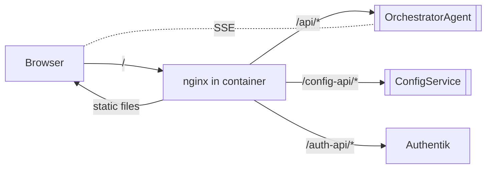

# frontend

> **Status:** Active
> **Flavor:** client
> **Container:** `frontend`
> **Port:** 5173 (host)
> **Tech:** React + Vite + TypeScript + nginx (serves built `dist/`)

---

## Role

Admin + user dashboard for haidoc. CRUD over every config table (agents, pipelines, prompts, LLM instances, roles, feature flags), job submission console, live SSE event viewer, dead-letter inspector. nginx reverse-proxies `/api/` → [[OrchestratorAgent]] and `/config-api/` → [[ConfigService]].

---

## Position in Pipeline



The `/api/` and `/config-api/` prefixes are **stripped by nginx** before reaching upstreams. Calling `localhost:8000/auth/login` (curl) and the browser calling `/api/auth/login` both reach the same orchestrator endpoint.

---

## Contracts

### Pages (`src/pages/`)

| Page | Hits | Purpose |
|---|---|---|
| `Dashboard.tsx` | `/api/v1/jobs/`, `/api/v1/agent-lag/` | Job summary + Kafka lag table |
| `JobConsole.tsx` | `POST /api/v1/process/text\|audio`, SSE `/api/v1/jobs/:id/stream` | Submit + watch jobs |
| `JobHistory.tsx` | `GET /api/v1/jobs/` | Filterable list |
| `JobDetail.tsx` | `GET /api/v1/jobs/:id`, SSE | Per-job state, steps, tokens |
| `FailedJobs.tsx` | `GET /api/v1/dlq/` | Dead-letter inspector (I7) |
| `PipelineBuilder.tsx` | `/config-api/pipelines/*` | React Flow drag-drop builder (Phase C) |
| `Pipelines.tsx` | `/config-api/pipelines/` | List + activate |
| `Agents.tsx` | `/config-api/agents/`, `/config-api/agent-definitions/` | Registry + Generic Agents tabs |
| `Prompts.tsx` | `/config-api/prompts/` | Versioned prompt editor |
| `Config.tsx` | `/config-api/config-entries/` | Generic KV editor |
| `LLMInstances.tsx` | `/config-api/llm-instances/` | LLM registry + activation (Phase B) |
| `AccessKeys.tsx` | `/api/v1/keys/` | `mk_` key CRUD (Phase D) |
| `Organisations.tsx` | `/api/v1/orgs/` | Org grouping (Phase O) |
| `Roles.tsx` | `/api/v1/roles/` | Role + user management (Phase E) |
| `FeatureFlags.tsx` | `/config-api/feature-flags/` | Toggle + role assign (Phase F) |
| `Webhooks.tsx` | `/api/v1/webhooks/` | Tenant webhook CRUD + secret rotate |
| `Menus.tsx` | `/config-api/nav/` | Navigation editor |
| `Profile.tsx` | `/api/auth/*` | User profile |
| `Register.tsx` | `POST /api/auth/register` | Self-register |

### Hooks (`src/hooks/`)

- `useAuth.tsx` — JWT context; `loginWithToken`, silent refresh on mount, logout
- `useFeatureFlags.tsx` — 60s poll of `/config-api/feature-flags/`; role-aware gating
- `useEventStream` (if present) — SSE consumer wrapping `EventSource`

### `src/lib/api.ts`

- axios instance
- Request interceptor: injects `Authorization: Bearer <jwt>` + `X-User-Role` header
- Response interceptor: on 401, silent refresh → retry once → on fail redirect to login

### Auth flow

- Login → `POST /api/auth/login` returns HS256 access JWT + refresh JWT
- Stored in: localStorage (access) + httpOnly cookie (refresh, set by orchestrator)
- Refresh: 401 interceptor calls `POST /api/auth/refresh`; rotates access token silently
- SSE: `EventSource` cannot set headers; access JWT passed via `?token=<jwt>` query param

### nginx (`nginx.conf`)

- `location /api/` → `proxy_pass http://orchestrator:8000/`
- `location /config-api/` → `proxy_pass http://config-service:8010/`
- `location /` → serves Vite-built `dist/` (SPA fallback to `index.html`)

---

## Dependencies

- **Backend services:** [[OrchestratorAgent]], [[ConfigService]], Authentik
- **External:** none
- **Build:** Node 20+, Vite, TypeScript 5+, React 18

---

## Side Effects

- localStorage / cookies for auth state
- SSE long-lived connections per open job
- Polling: feature flags (60s), Kafka lag table (variable)

---

## Failure Modes

| Symptom | Cause | Fix |
|---|---|---|
| `npx tsc` installs wrong package | npm cache miss installs `tsc@2.0.4` (broken) | Use `./node_modules/.bin/tsc --noEmit` |
| 401 loop after login | Refresh JWT cookie not set or `JWT_SECRET` mismatch | Check cookie in devtools; align orchestrator/config secret |
| SSE never connects | Browser blocks `?token=` over HTTP; or token expired | HTTPS in prod; refresh token before opening |
| Pipeline save 422 | Node payload missing `agent_type` discriminator | Frontend bug — must set per-node `agent_type` |
| Feature flag not respected | 60s cache TTL; or role list missing | Wait 60s or hit refresh |
| Page blank on prod | nginx misconfigured SPA fallback | `try_files $uri $uri/ /index.html;` |

---

## PHI Surface

- **Display:** transcripts, SOAP notes, diagnoses rendered in `JobDetail.tsx` and SSE token stream
- **Persistence:** not in localStorage by default — but verify each new page doesn't cache PHI client-side
- **Console logs:** strip in production build (Vite drops `console.*` if configured)
- **Auth tokens:** localStorage is XSS-vulnerable — never store PHI there

---

## Config

| Var | Purpose |
|---|---|
| `VITE_*` env vars in `.env` | Build-time config (rare) |

nginx-side config (proxy targets) is in `nginx.conf` — bake at build time.

---

## Observability

- Browser console errors (Vite shows in dev)
- nginx access logs in container
- No frontend metrics export today (could add `web-vitals` → orchestrator endpoint)

---

## Common Change Recipes

### Add a new admin page
1. New file in `src/pages/<Name>.tsx`
2. Register in `App.tsx` router
3. Add nav item via `Menus.tsx` (or seed via `navigation` table in [[ConfigService]])
4. Optionally feature-flag with `useFeatureFlags()`

### Hit a new orchestrator endpoint
- Use `api` from `src/lib/api.ts` — `api.get('/v1/<new-route>')` (the `/api/` prefix is added by axios baseURL + nginx)

### Add an SSE event handler
1. Subscribe in `useEventStream` (or page-local `EventSource`)
2. Add case for the new `event` name
3. Add event type to [`CLAUDE.md`](../CLAUDE.md#sse-event-types)

### Type-check
```bash
cd frontend && ./node_modules/.bin/tsc --noEmit
# NOT: npx tsc — installs wrong package on cache miss
```

### Run dev server
```bash
cd frontend && npm run dev   # Vite on 5173
```

---

## Cross-links

- [[OrchestratorAgent]] — every `/api/*` call lands there
- [[ConfigService]] — every `/config-api/*` call lands there
- [[android]] — sibling client; should share API contract docs
- [`CLAUDE.md`](../CLAUDE.md) — `npx tsc` warning, login path warning (`/auth/login` host vs `/api/auth/login` browser), SSE event list
